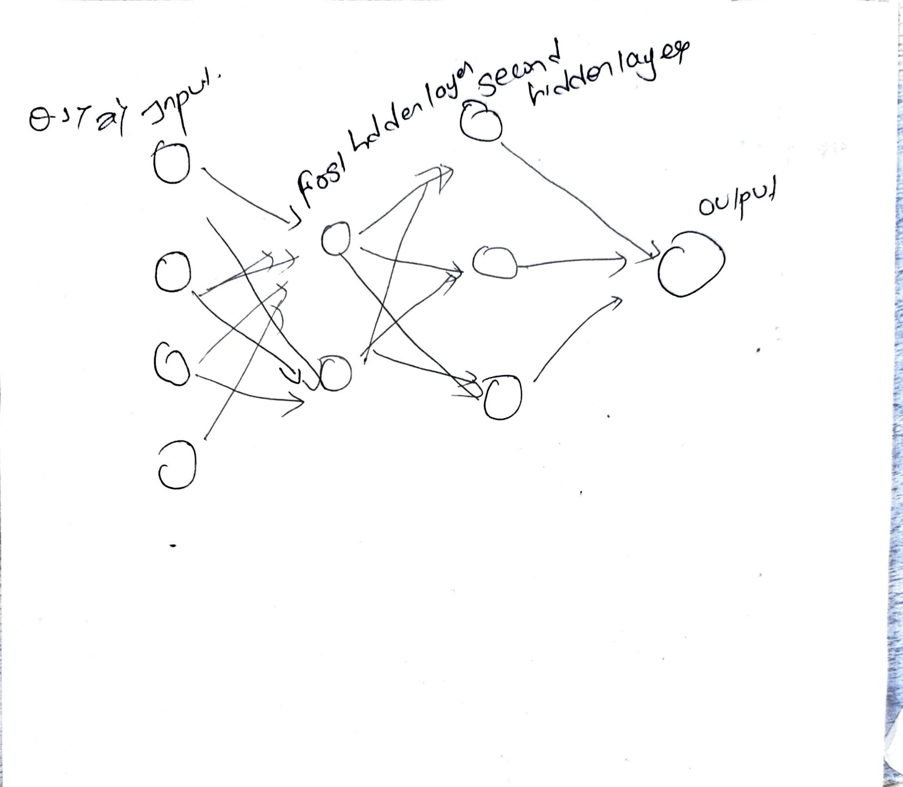
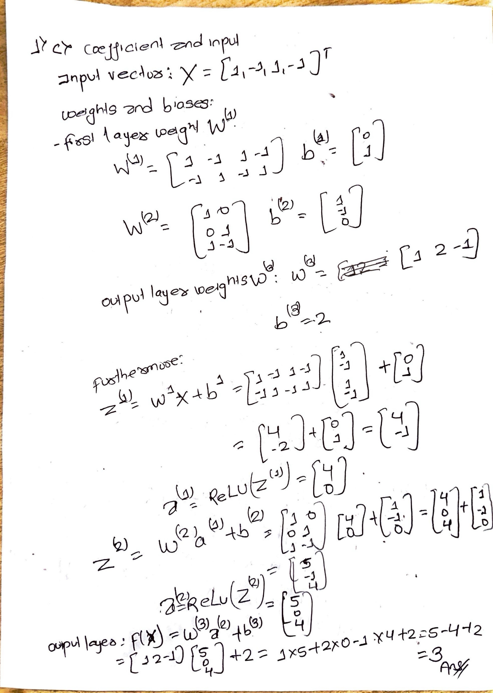
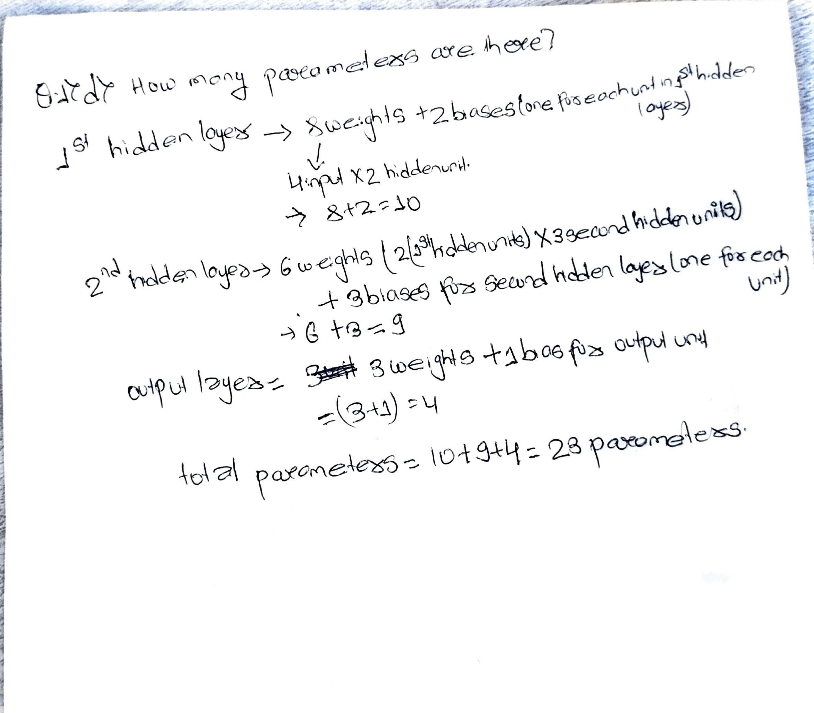
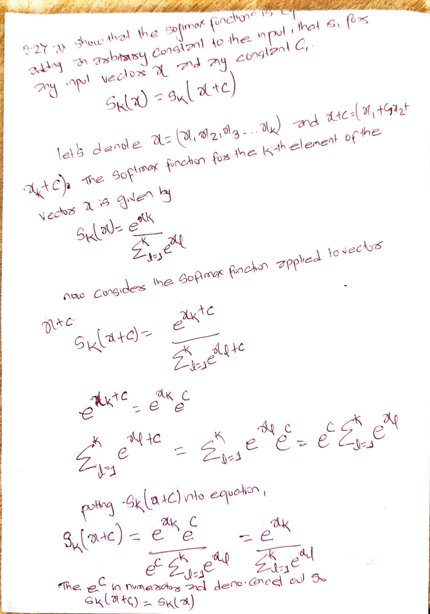
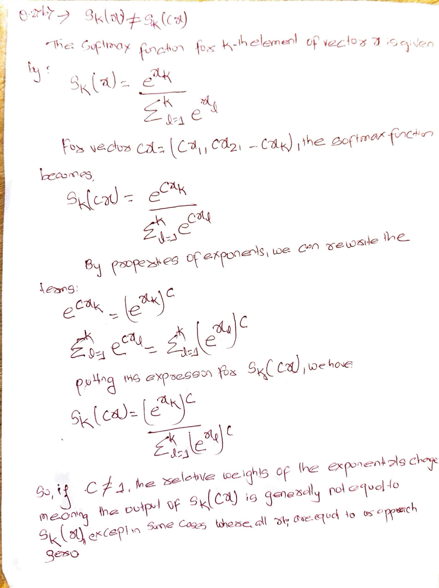
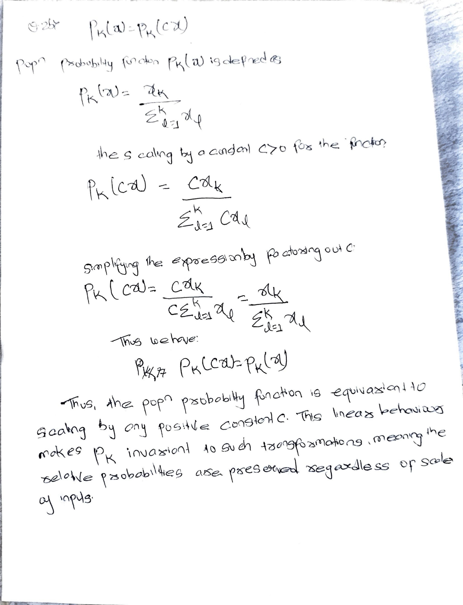
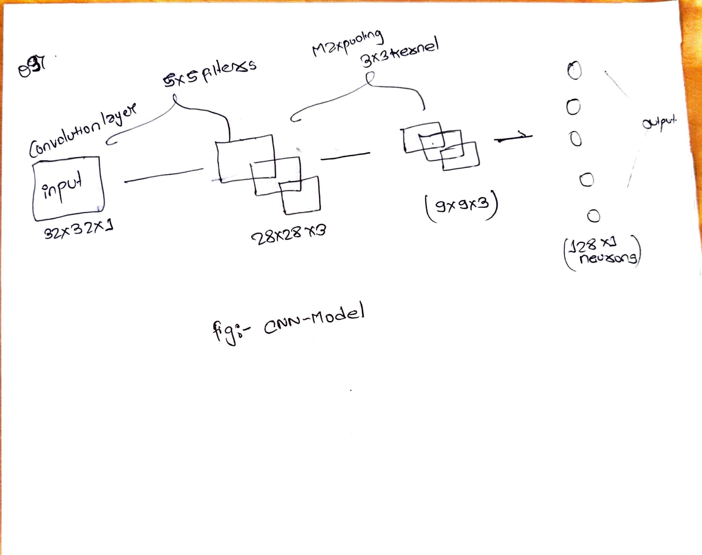
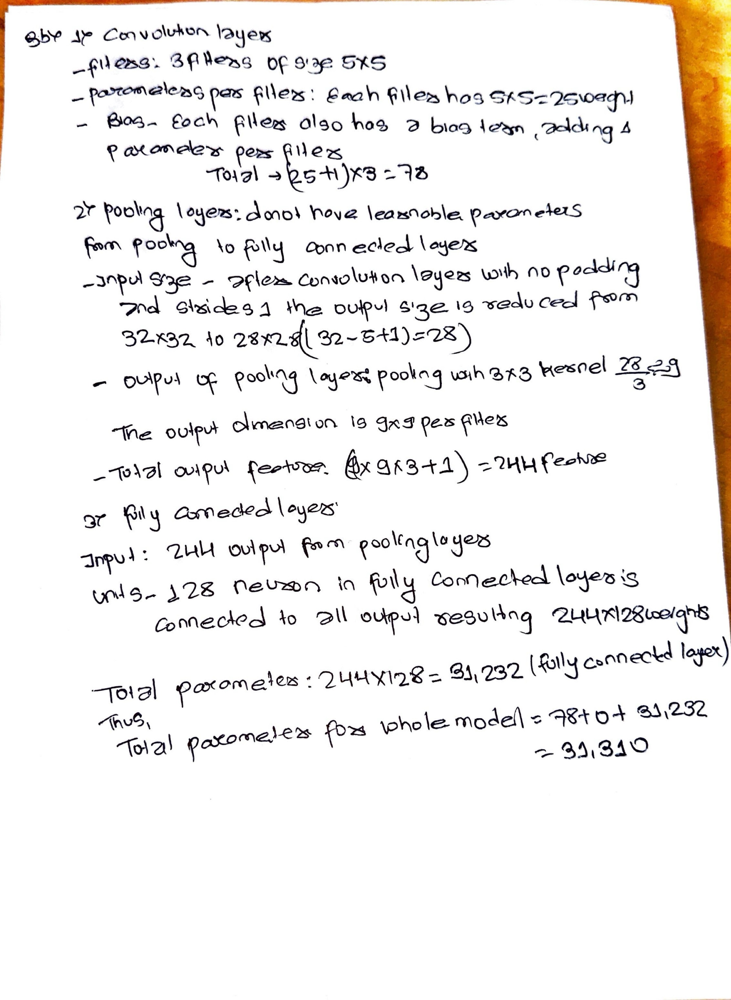

## Homework 4
This homework is due on 04/29/2024 by 11:59 PM. Homework 4 is about deep neural network.

### Question 1 
Consider a neural network with two hidden layers: $p=4$ input units, $2$ units in the first hidden layer, $3$ units in the second hidden layer, and a single output.

(a) Draw a picture of the network, similar to the following: 

(b) Write out an expression for $f(X)$, assuming ReLU activation functions. Be as explicit as possible.\
To derive the expression for the output \( f(X) \) of a neural network with two hidden layers, using the ReLU activation function, let's define the structure based on the number of units and the description provided:\
- **Input Vector:** $( X = [x_1, x_2, x_3, x_4]^T)$
- **Weights and Biases:**
  - **First Layer:** Weights $W^{(1)}$ and biases $b^{(1)}$
  - **Second Layer:** Weights $W^{(2)}$ and biases $b^{(2)}$
  - **Output Layer:** Weights $W^{(3)}$ and biases $b^{(3)}$

- **ReLU Activation Function:** Defined as $text{ReLU}(z)= max (0, z)$

### Layer-by-Layer Computation

1. **From Input to First Hidden Layer:**
   - $W^{(1)}$ is a $(2 \times 4)$ matrix (since there are 2 units in the first hidden layer and 4 inputs).
   - $( b^{(1)})$ is a $(2 \times 1)$ vector.
   - The output of the first hidden layer before activation is:
     [
     $z^{(1)} = W^{(1)}X + b^{(1)}$
     ]
   - After applying the ReLU activation:
     [
     $a^{(1)} = \text{ReLU}(z^{(1)})$
     ]

2. **From First Hidden Layer to Second Hidden Layer:**
   - $(W^{(2)})$ is a $(3 \times 2)$ matrix (since there are 3 units in the second hidden layer and 2 units in the first hidden layer).
   - $(b^{(2)})$ is a $(3 \times 1)$ vector.
   - The output of the second hidden layer before activation is:
     [
     $z^{(2)} = W^{(2)}a^{(1)} + b^{(2)}$
     ]
   - After applying the ReLU activation:
     [
     $a^{(2)} = \text{ReLU}(z^{(2)})$
     ]

3. **From Second Hidden Layer to Output Layer:**
   - $( W^{(3)})$ is a $(1 \times 3)$ matrix (since there is 1 unit in the output layer and 3 units in the second hidden layer).
   - $( b^{(3)})$ is a scalar $(1 \times 1)$.
   - The output of the network before the final activation (if any) is:
     [
     $z^{(3)} = W^{(3)}a^{(2)} + b^{(3)}$
     ]
   - Assuming no activation or a linear activation in the output layer:
     [
     $f(X) = z^{(3)}$
     ]

The function $( f(X))$ combining all the steps and using the ReLU function explicitly can be written as:
[$f(X) = W^{(3)}\text{ReLU}(W^{(2)}\text{ReLU}(W^{(1)}X + b^{(1)}) + b^{(2)}) + b^{(3)}$]
Here, each $(\text{ReLU})$ wraps the linear transformation of the previous layer's output and the current layer's weights and biases, sequentially processing the data through the network from the input to the output.

(c) Now plug in some values for the coefficients and write out the value of $f(X)$.

(d) How many parameters are there?

### Question 2
Consider the *softmax* fucntion $S_k(x) = \frac{e^{x_k}}{\sum_{l=1}^{K} e^{x_l}}$ for $k=1,2,...,K$.

(a) Show that the *softmax* function is equivariant to adding an arbitrary constant to the input, that is, for any input vector $x$ and any constant $c$, 
$$S_k(x) = S_k(x+c)$$

(b) Show that the *softmax* function is not equivariant to multiplying all elements of the input by a constant $c>0$, that is, for any input vector $x$ and any constant $c>0$,
$$S_k(x) \neq S_k(cx)$$

Compare the softmax function with the population probility function $P_k(x) = \frac{x_k}{\sum_{l=1}^{K} x_l}$ for $k=1,2,...,K$. Show that the population probability function is equivariant to multiplying all elements of the input by a constant $c>0$, that is, for any input vector $x$ and any constant $c>0$,
$$P_k(x) = P_k(cx)$$

### Question 3 
Consider a CNN that takes a $32 \times 32$ grayscale image as input. The CNN consists of a convolutional layer with $3$ filters of size $5 \times 5$, a $3 \times 3$ pooling layer, and a fully connected layer with $128$ units. (no boundary padding and stride is one)

(a) Draw a picture of the network, similar to the following:

(b) How many parameters are in this model?

(c) Explain how this model can be thought of as an ordinary feedforward neural network with the individual pixel values as inputs, and with constraints on the weights in the hidden units. What are the constraints?
This CNN can be seen as an ordinary feed forward neural network where each neuron in the hidden layer corresponds to a $5 \times 5$ patch of pixels in the input image, with the same set of weights applied to different patches (convolutional layer). After convolution, neurons in the next layer combine features from previous layers within a $3 \times 3$ region (pooling). The fully connected layer then operates like a standard FNN layer. The constraints are:
1. Local connectivity: Neurons in a layer are only connected to a small region of the previous layer.
2. Weight sharing: The same weights are used for neurons that process different regions of the input layer.
3. Pooling: Downsamples the output of the neurons, providing translation invariance to the internal representation.

### Question 4 
This is optional. If you choose to answer this question, you will receive extra credit.

Think about CNN and RNN. Can you come up with a new neural network architecture that combines the two? Explain how this new architecture works and why it might be useful.
Use keras and MNIST dataset to show the performance of your new architecture. 
Ans: In home4.ipynb file
