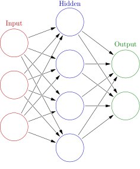

## Homework 4
This homework is due on 04/29/2024 by 11:59 PM. Homework 4 is about deep neural network.

### Question 1 
Consider a neural network with two hidden layers: $p=4$ input units, $2$ units in the first hidden layer, $3$ units in the second hidden layer, and a single output.

(a) Draw a picture of the network, similar to the following: 

(b) Write out an expression for $f(X)$, assuming ReLU activation functions. Be as explicit as possible.

(c) Now plug in some values for the coefficients and write out the value of $f(X)$.

(d) How many parameters are there?

### Question 2
Consider the *softmax* fucntion $S_k(x) = \frac{e^{x_k}}{\sum_{l=1}^{K} e^{x_l}}$ for $k=1,2,...,K$.

(a) Show that the *softmax* function is equivariant to adding an arbitrary constant to the input, that is, for any input vector $x$ and any constant $c$, 
$$S_k(x) = S_k(x+c)$$

(b) Show that the *softmax* function is not equivariant to multiplying all elements of the input by a constant $c>0$, that is, for any input vector $x$ and any constant $c>0$,
$$S_k(x) \neq S_k(cx)$$
Compare the softmax function with the population probility function $P_k(x) = \frac{x_k}{\sum_{l=1}^{K} x_l}$ for $k=1,2,...,K$. Show that the population probability function is equivariant to multiplying all elements of the input by a constant $c>0$, that is, for any input vector $x$ and any constant $c>0$,
$$P_k(x) = P_k(cx)$$

### Question 3 
Consider a CNN that takes a $32 \times 32$ grayscale image as input. The CNN consists of a convolutional layer with $3$ filters of size $5 \times 5$, a $3 \times 3$ pooling layer, and a fully connected layer with $128$ units. (no boundary padding and stride is one)

(a) Draw a picture of the network, similar to the following:

(b) How many parameters are in this model?

(c) Explain how this model can be thought of as an ordinary feedforward neural network with the individual pixel values as inputs, and with constraints on the weights in the hidden units. What are the constraints?

### Question 4 
This is optional. If you choose to answer this question, you will receive extra credit.

Think about CNN and RNN. Can you come up with a new neural network architecture that combines the two? Explain how this new architecture works and why it might be useful.
Use keras and MNIST dataset to show the performance of your new architecture.
